# Homework 9
## Questions
### 1. How long does it take to complete the training run? (hint: this session is on distributed training, so it will take a while)
  - It took about 18 hours to train with 40,000 training steps with 2 nodes and four V-100 GPUs total.
### 2. Do you think your model is fully trained? How can you tell?
  - I think the model is not fully trained but close to fully trained because although the BLEU Score is slightly increasing, it is fairly stabilized (like the Train Loss graph) as shown below; so, I would expect to see a slightly higher BLEU score once the model is fully trained but would not expect to see a huge change between my final model and a fully trained model.
  - Graphs

|            BLEU Score           |                 Train Loss                |
|:-------------------------------:|:-----------------------------------------:|
| 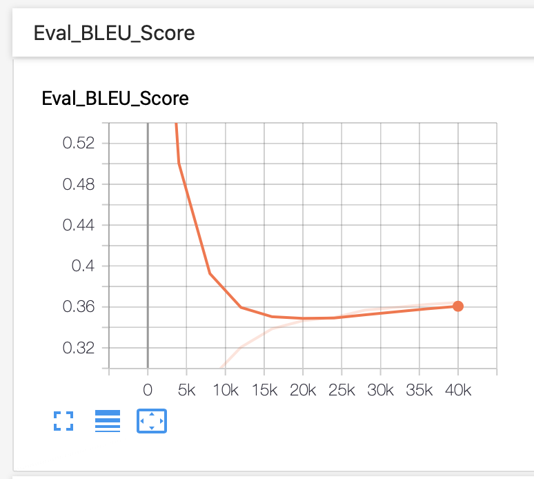 | 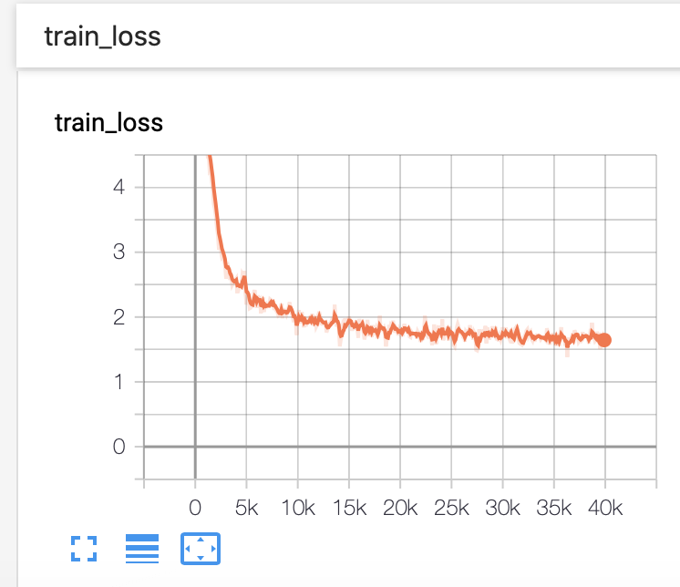 |

### 3. Were you overfitting?
  - Looking the train and validation loss graphs, I do not see a sign of overfitting as both training and validation loss decrease to a point of stability with a minimal gap between the two final loss values.
  - Graphs

|                 Train Loss                | Evaluation(Validation) Loss |
|:-----------------------------------------:|:---------------------------:|
|  |  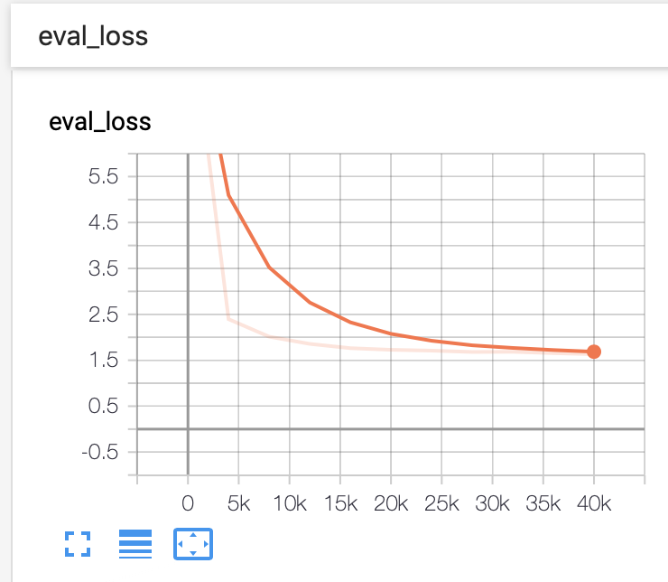  |

### 4. Were your GPUs fully utilized?
  - All of them were fully utilized for the most of the time as shown below. Even when all GPUs were not fully utilized, the utilization rate was quite high with a value of at least around 80% on one GPU and the remaining fully (or almost fully) utilized GPUs.
  - GPU Utilization of v100a and v100b

|                   v100a                  |                   v100b                  |
|:----------------------------------------:|:----------------------------------------:|
| 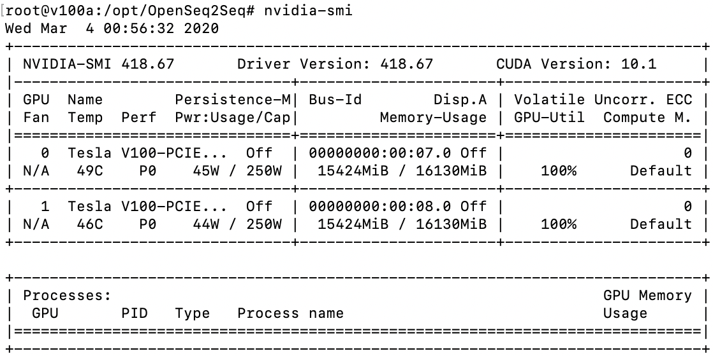 | 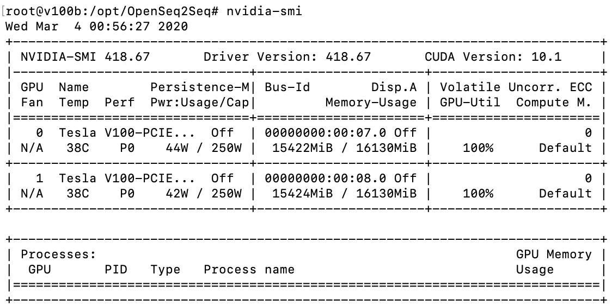 |

### 5. Did you monitor network traffic (hint: apt install nmon)? Was network the bottleneck?
  - Answer
  - Network Monitoring of v100a and v100b

|                   v100a                   |                   v100b                   |
|:-----------------------------------------:|:-----------------------------------------:|
| 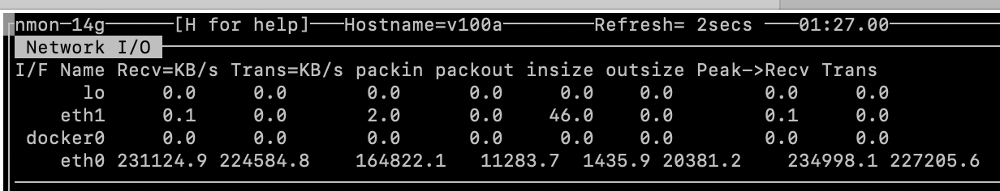 | 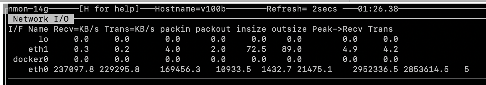 |

### 6. Take a look at the plot of the learning rate and then check the config file. Can you explain this setting?
  - Answer
  - Learning Rate Graph

  - Configuration
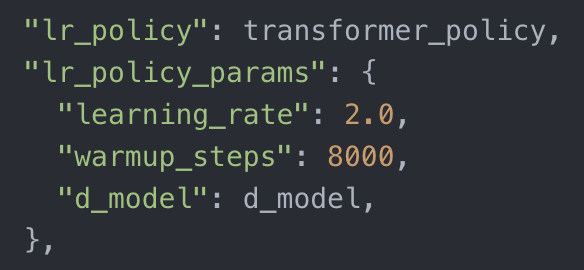

### 7. How big was your training set (mb)? How many training lines did it contain?
  - **Size of the Training Set (MB)**: 1,348MB(English=637MB, German=711MB)
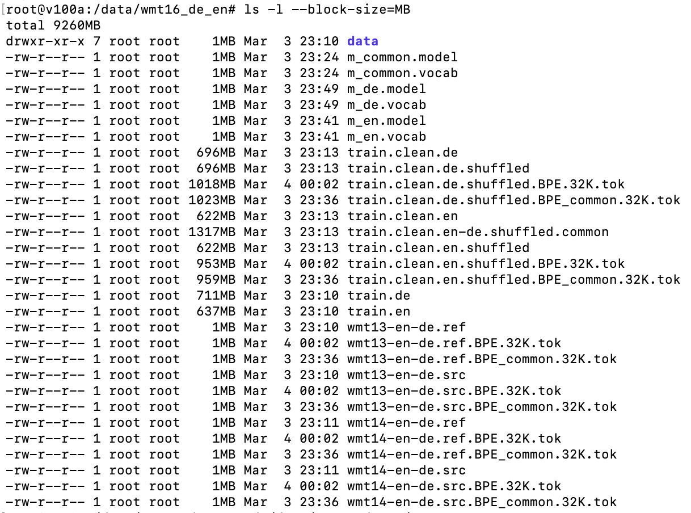

  - **Lines of the Training Set**: 4,562,102
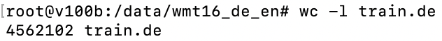
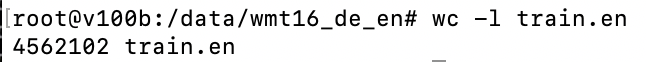

### 8. What are the files that a TF checkpoint is comprised of?
  - The checkpoint file in the *en_de_transformer* folder consists of model checkpoint paths(filename) for the initial training step(0) and the last training step(40,000) - *final model that has the lowest validation loss value*, whereas the checkpoint file in the best models folder consists of model checkpoint paths for the top five models that have five lowest validation loss values.
  - Final Checkpoint Content
```
model_checkpoint_path: "model.ckpt-40000"
all_model_checkpoint_paths: "model.ckpt-0"
all_model_checkpoint_paths: "model.ckpt-40000"
```
  - Best Model Checkpoint Content
```
model_checkpoint_path: "val_loss=1.6316-step-40000"
all_model_checkpoint_paths: "val_loss=1.7279-step-20006"
all_model_checkpoint_paths: "val_loss=1.7100-step-24007"
all_model_checkpoint_paths: "val_loss=1.6805-step-28008"
all_model_checkpoint_paths: "val_loss=1.6543-step-36010"
all_model_checkpoint_paths: "val_loss=1.6316-step-40000"
```

### 9. How big is your resulting model checkpoint (mb)?
  - As shown in the above question, because it does not store the model checkpoint path for all training steps, the file size is significantly small - 4KB. If it would have contained all the files for all the training steps, the file size would have been significantly larger.

### 10. Remember the definition of a "step". How long did an average step take?
  - A step is an event of processing one batch where a batch is a number of samples that are processed together before gradients are calculated.
  - Average time per step was 1.625s.

### 11. How does that correlate with the observed network utilization between nodes?
  - They are inversely correlated: *the more the network is utilized, the lower the average time per step and vice versa*.
